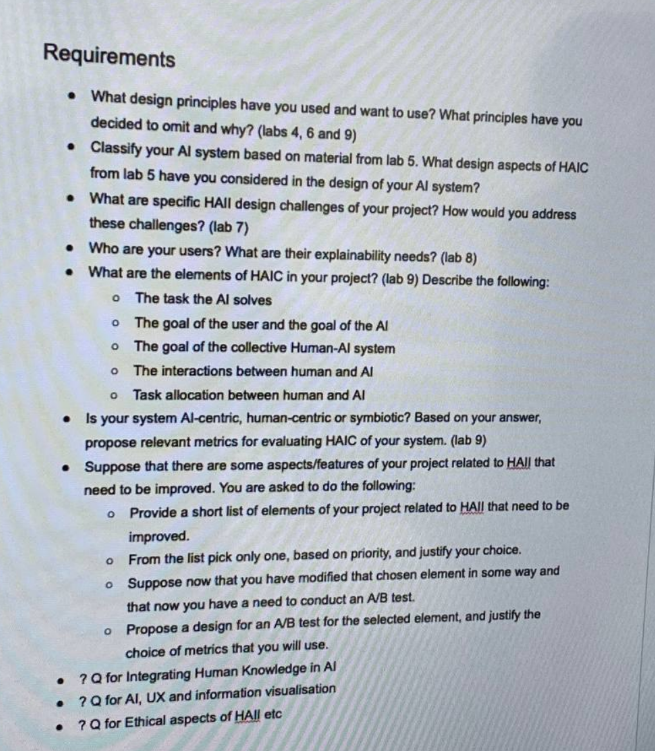

### Используемые технологии:
- для фронта - streamlit
- для бэкенда - fast api
- Ml - pretrained model + NLP(RAG?)
- различные визуалиции matplotlib / plotly

### Что будет оцениваться:
#### (a) System Functionality (8 marks)
##### Implementation of the ML algorithm.
- будет мл модель и алгоритм 
##### Meeting the specified requirements.
- главная цель: определение тональности(эмоцию), добавить объяснений, сгенерировать совет
##### Ensuring robustness of the system.
- обработка мелких ошибок

#### (b) UI Design (14 marks)
##### Application of UI design principles.
- простенький и минималистичный интерфейс на стримлит
##### Use of Information Visualization techniques and principles.
- Различные графики из плотли/матлаблиб

#### (c) Documentation (10 marks)
##### Document design choices with references to relevant literature.
- написать документацию 

#### (d) Reflection on Human-AI Interaction Design principles (18 marks)
##### Provide insights on how design principles were applied in the project.
- 
##### Include references to papers discussed during the course and other
useful sources.
- вставить референсы из силлабуса 
##### Share lessons learned during the project development.
- Саммари+лимитэйшн проекта 

### Какие принцпипы можно применить: 

## Интерпретируемость:
- Показываем ключевые слова/эмоции, вызывавшие такую оценку
## Вовлечение пользователя:
- Возможность давать фидбек на ответ
- Добавить графики(например: динамика настроение в течение недели)
## Этика
- Нет диагнозов, советы общие, анонимность, локальная обработка
## Доступность:	
- Простая форма, цветовая индикация, читаемые шрифты
## Управление вниманием пользователя
- Выделение эмоции крупным шрифтом + мягкие цвета
## Контроль пользователя:
- Добавить регистрацию локальную 
- Пользователь может не согласиться с рекомендацией и ввести новый текст.

#### Что нужно сделать:
- Бэкенд на фаст апи и фронт на стримлите
- Реализовать мл алгоритм с предобученной моделью
- реализовать различные доп фичи(регистрацию, фидбек)
- Добавить различные простенькие графики/визуализацию
- написать документацию/рефлексию по проекту
- сделать презентацию небольную для защиты 

